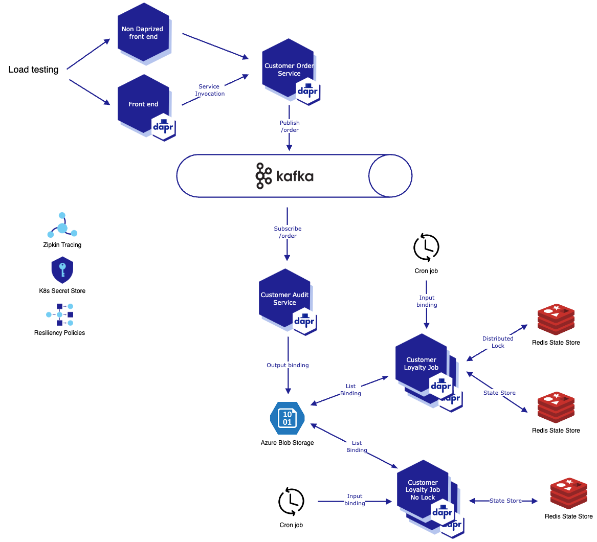

## Dapr Resiliency Demo

A sample order system composed of four Dapr-enabled microservices to showcase Dapr [resiliency](https://docs.dapr.io/operations/resiliency/resiliency-overview/) and [distributed lock](https://docs.dapr.io/developing-applications/building-blocks/distributed-lock/distributed-lock-api-overview/) features. Demoed at Kubecon North America 2022.

### Architecture and Service Definitions

The system is composed of four .NET Core 6 microservices and a simple Javascript frontend. The front-end has two versions of its associated Kubernetes manifests to be deployed with and without Dapr. The customer loyalty job also has two versions of the same code, to be deployed with and without using the distributed lock API. Additional service details and their Dapr components below.

| Service          | Definition                                                                                                 | Dapr Component(s) |
|------------------|-------------------------------------------------------------------------------------------------------------| --------------------------------|
| Frontend | Simple app that posts to an HTTP endpoint to place an order from one of 10 customers and logs the result | Service to service invocation, Resiliency policy  |
| Non Daprized Frontend | Simple app that posts to an HTTP endpoint to place an order from one of 10 customers and logs the result | N/A |
| Customer Order Service | Exposes an API endpoint that publishes a customer order on a message broker | Kafka publisher, Pub/sub resiliency policy |
| Customer Audit Service | Exposes an API endpoint that subscribes to a message broker and outputs the order to a storage bucket | Kafka subscriber, Azure Blob output binding |
| Customer Loyalty Job | Background job that reads orders in storage bucket, updates customers' loyalty points using a lock then saves order to database | Cron input binding, Azure Blob list binding, Redis distributed lock , Redis state store |
| Customer Loyalty Job No Lock | Background job that reads orders in storage bucket, updates customers' loyalty points then saves order to database | Cron input binding, Azure Blob list binding, Redis state store |

### Prerequisites

The deployment is tailored to Azure today but could be adapted for any K8s cluster.

- Kubernetes cluster
- Azure CLI
- Helm
- Chaos tool, we used [Azure Chaos Studio](https://azure.microsoft.com/en-us/products/chaos-studio/)
- [ddosify](https://github.com/ddosify/ddosify) or another load generator

### Deployment

Run the commands in the [./deploy/deployment-script.sh](./deploy/deployment-script.sh) script one by one for best results. All Dapr components are deployed within the cluster today save Azure blob storage.

To demo run the chaos test and your load generator to see the non-Daprized frontend failing and the Dapr-enabled front-end retrying via it's resiliency policy. Clear the Kafka message broker and Redis state store before sending a specified number of orders through to the backend. Inspecting the Redis state store should show the correct order count and loyalty points for the `customer-loyalty-job` and an incorrect (higher) order count for the `customer-loyalty-job-nolock` application.
